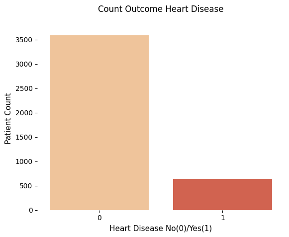
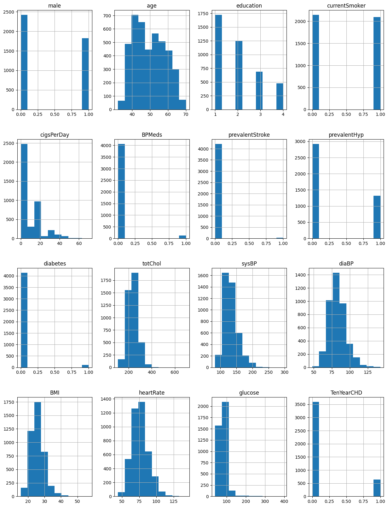
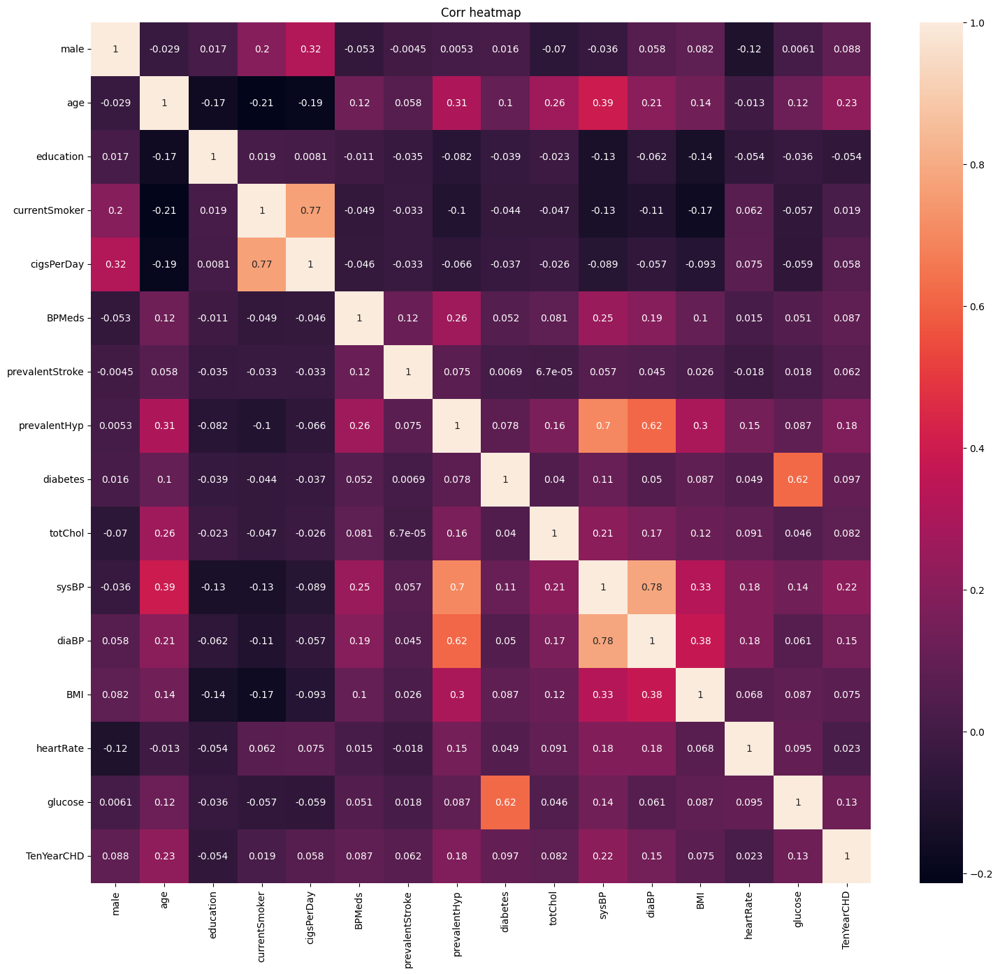
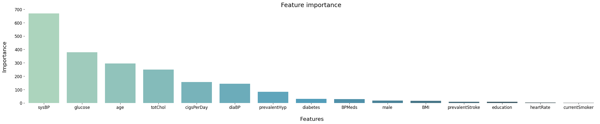

# 分析Framingham資料，判斷病人10年內罹患心血管疾病的機率及其罹患心血管疾病最可能的三大特徵

## 流程思考：

1. 先對 framingham.csv 檔案進行初步的資料檢閱
2. 了解各Column 的意義
3. 缺失值處理
4. Encoding categorical data （觀察此表格已經是數字了）
5. 特徵觀察

### 載入資料，並觀察


```python
# Importing the libraries
import numpy as np
import matplotlib.pyplot as plt
import pandas as pd

```


```python
# Importing the dataset
dataset = pd.read_csv('framingham.csv')

```

先檢視前10筆資料的樣貌


```python
dataset.head(10)
```


<div>
<style scoped>
    .dataframe tbody tr th:only-of-type {
        vertical-align: middle;
    }

    .dataframe tbody tr th {
        vertical-align: top;
    }

    .dataframe thead th {
        text-align: right;
    }
</style>
<table border="1" class="dataframe">
  <thead>
    <tr style="text-align: right;">
      <th></th>
      <th>male</th>
      <th>age</th>
      <th>education</th>
      <th>currentSmoker</th>
      <th>cigsPerDay</th>
      <th>BPMeds</th>
      <th>prevalentStroke</th>
      <th>prevalentHyp</th>
      <th>diabetes</th>
      <th>totChol</th>
      <th>sysBP</th>
      <th>diaBP</th>
      <th>BMI</th>
      <th>heartRate</th>
      <th>glucose</th>
      <th>TenYearCHD</th>
    </tr>
  </thead>
  <tbody>
    <tr>
      <th>0</th>
      <td>1</td>
      <td>39</td>
      <td>4.0</td>
      <td>0</td>
      <td>0.0</td>
      <td>0.0</td>
      <td>0</td>
      <td>0</td>
      <td>0</td>
      <td>195.0</td>
      <td>106.0</td>
      <td>70.0</td>
      <td>26.97</td>
      <td>80.0</td>
      <td>77.0</td>
      <td>0</td>
    </tr>
    <tr>
      <th>1</th>
      <td>0</td>
      <td>46</td>
      <td>2.0</td>
      <td>0</td>
      <td>0.0</td>
      <td>0.0</td>
      <td>0</td>
      <td>0</td>
      <td>0</td>
      <td>250.0</td>
      <td>121.0</td>
      <td>81.0</td>
      <td>28.73</td>
      <td>95.0</td>
      <td>76.0</td>
      <td>0</td>
    </tr>
    <tr>
      <th>2</th>
      <td>1</td>
      <td>48</td>
      <td>1.0</td>
      <td>1</td>
      <td>20.0</td>
      <td>0.0</td>
      <td>0</td>
      <td>0</td>
      <td>0</td>
      <td>245.0</td>
      <td>127.5</td>
      <td>80.0</td>
      <td>25.34</td>
      <td>75.0</td>
      <td>70.0</td>
      <td>0</td>
    </tr>
    <tr>
      <th>3</th>
      <td>0</td>
      <td>61</td>
      <td>3.0</td>
      <td>1</td>
      <td>30.0</td>
      <td>0.0</td>
      <td>0</td>
      <td>1</td>
      <td>0</td>
      <td>225.0</td>
      <td>150.0</td>
      <td>95.0</td>
      <td>28.58</td>
      <td>65.0</td>
      <td>103.0</td>
      <td>1</td>
    </tr>
    <tr>
      <th>4</th>
      <td>0</td>
      <td>46</td>
      <td>3.0</td>
      <td>1</td>
      <td>23.0</td>
      <td>0.0</td>
      <td>0</td>
      <td>0</td>
      <td>0</td>
      <td>285.0</td>
      <td>130.0</td>
      <td>84.0</td>
      <td>23.10</td>
      <td>85.0</td>
      <td>85.0</td>
      <td>0</td>
    </tr>
    <tr>
      <th>5</th>
      <td>0</td>
      <td>43</td>
      <td>2.0</td>
      <td>0</td>
      <td>0.0</td>
      <td>0.0</td>
      <td>0</td>
      <td>1</td>
      <td>0</td>
      <td>228.0</td>
      <td>180.0</td>
      <td>110.0</td>
      <td>30.30</td>
      <td>77.0</td>
      <td>99.0</td>
      <td>0</td>
    </tr>
    <tr>
      <th>6</th>
      <td>0</td>
      <td>63</td>
      <td>1.0</td>
      <td>0</td>
      <td>0.0</td>
      <td>0.0</td>
      <td>0</td>
      <td>0</td>
      <td>0</td>
      <td>205.0</td>
      <td>138.0</td>
      <td>71.0</td>
      <td>33.11</td>
      <td>60.0</td>
      <td>85.0</td>
      <td>1</td>
    </tr>
    <tr>
      <th>7</th>
      <td>0</td>
      <td>45</td>
      <td>2.0</td>
      <td>1</td>
      <td>20.0</td>
      <td>0.0</td>
      <td>0</td>
      <td>0</td>
      <td>0</td>
      <td>313.0</td>
      <td>100.0</td>
      <td>71.0</td>
      <td>21.68</td>
      <td>79.0</td>
      <td>78.0</td>
      <td>0</td>
    </tr>
    <tr>
      <th>8</th>
      <td>1</td>
      <td>52</td>
      <td>1.0</td>
      <td>0</td>
      <td>0.0</td>
      <td>0.0</td>
      <td>0</td>
      <td>1</td>
      <td>0</td>
      <td>260.0</td>
      <td>141.5</td>
      <td>89.0</td>
      <td>26.36</td>
      <td>76.0</td>
      <td>79.0</td>
      <td>0</td>
    </tr>
    <tr>
      <th>9</th>
      <td>1</td>
      <td>43</td>
      <td>1.0</td>
      <td>1</td>
      <td>30.0</td>
      <td>0.0</td>
      <td>0</td>
      <td>1</td>
      <td>0</td>
      <td>225.0</td>
      <td>162.0</td>
      <td>107.0</td>
      <td>23.61</td>
      <td>93.0</td>
      <td>88.0</td>
      <td>0</td>
    </tr>
  </tbody>
</table>
</div>


就表頭字面上來看

| **欄位名稱**        | **字面意義** |
|:---------------:|:---------:|
| male            | 是否為男性     |
| age             | 年齡        |
| education       | 教育程度      |
| currentSmoker   | 最近是否吸菸    |
| cigsPerDay      | 每天抽幾根菸    |
| BPMeds          | 服用血壓藥物    |
| prevalentStroke | 中風        |
| prevalentHyp    | 高血壓       |
| diabetes        | 糖尿病       |
| totChol         | 總膽固醇      |
| sysBP           | 心臟收縮壓     |
| diaBP           | 舒張壓       |
| BMI             | BMI       |
| heartRate       | 心率        |
| glucose         | 血糖        |
| TenYearCHD      | 心血管疾病風險   |


以Pandas 中 Dataframe.info()函式可以顯示資料表內所有欄位的資訊。包含:欄位名稱、非虛值的數目、欄位的資料類型等等。


```python
dataset.info()
```

    <class 'pandas.core.frame.DataFrame'>
    RangeIndex: 4238 entries, 0 to 4237
    Data columns (total 16 columns):
     #   Column           Non-Null Count  Dtype  
    ---  ------           --------------  -----  
     0   male             4238 non-null   int64  
     1   age              4238 non-null   int64  
     2   education        4133 non-null   float64
     3   currentSmoker    4238 non-null   int64  
     4   cigsPerDay       4209 non-null   float64
     5   BPMeds           4185 non-null   float64
     6   prevalentStroke  4238 non-null   int64  
     7   prevalentHyp     4238 non-null   int64  
     8   diabetes         4238 non-null   int64  
     9   totChol          4188 non-null   float64
     10  sysBP            4238 non-null   float64
     11  diaBP            4238 non-null   float64
     12  BMI              4219 non-null   float64
     13  heartRate        4237 non-null   float64
     14  glucose          3850 non-null   float64
     15  TenYearCHD       4238 non-null   int64  
    dtypes: float64(9), int64(7)
    memory usage: 529.9 KB
    


```python
# 對所有欄位執行 describe 
dataset.describe(include='all')
```


<div>
<style scoped>
    .dataframe tbody tr th:only-of-type {
        vertical-align: middle;
    }

    .dataframe tbody tr th {
        vertical-align: top;
    }

    .dataframe thead th {
        text-align: right;
    }
</style>
<table border="1" class="dataframe">
  <thead>
    <tr style="text-align: right;">
      <th></th>
      <th>male</th>
      <th>age</th>
      <th>education</th>
      <th>currentSmoker</th>
      <th>cigsPerDay</th>
      <th>BPMeds</th>
      <th>prevalentStroke</th>
      <th>prevalentHyp</th>
      <th>diabetes</th>
      <th>totChol</th>
      <th>sysBP</th>
      <th>diaBP</th>
      <th>BMI</th>
      <th>heartRate</th>
      <th>glucose</th>
      <th>TenYearCHD</th>
    </tr>
  </thead>
  <tbody>
    <tr>
      <th>count</th>
      <td>4238.000000</td>
      <td>4238.000000</td>
      <td>4133.000000</td>
      <td>4238.000000</td>
      <td>4209.000000</td>
      <td>4185.000000</td>
      <td>4238.000000</td>
      <td>4238.000000</td>
      <td>4238.000000</td>
      <td>4188.000000</td>
      <td>4238.000000</td>
      <td>4238.000000</td>
      <td>4219.000000</td>
      <td>4237.000000</td>
      <td>3850.000000</td>
      <td>4238.000000</td>
    </tr>
    <tr>
      <th>mean</th>
      <td>0.429212</td>
      <td>49.584946</td>
      <td>1.978950</td>
      <td>0.494101</td>
      <td>9.003089</td>
      <td>0.029630</td>
      <td>0.005899</td>
      <td>0.310524</td>
      <td>0.025720</td>
      <td>236.721585</td>
      <td>132.352407</td>
      <td>82.893464</td>
      <td>25.802008</td>
      <td>75.878924</td>
      <td>81.966753</td>
      <td>0.151958</td>
    </tr>
    <tr>
      <th>std</th>
      <td>0.495022</td>
      <td>8.572160</td>
      <td>1.019791</td>
      <td>0.500024</td>
      <td>11.920094</td>
      <td>0.169584</td>
      <td>0.076587</td>
      <td>0.462763</td>
      <td>0.158316</td>
      <td>44.590334</td>
      <td>22.038097</td>
      <td>11.910850</td>
      <td>4.080111</td>
      <td>12.026596</td>
      <td>23.959998</td>
      <td>0.359023</td>
    </tr>
    <tr>
      <th>min</th>
      <td>0.000000</td>
      <td>32.000000</td>
      <td>1.000000</td>
      <td>0.000000</td>
      <td>0.000000</td>
      <td>0.000000</td>
      <td>0.000000</td>
      <td>0.000000</td>
      <td>0.000000</td>
      <td>107.000000</td>
      <td>83.500000</td>
      <td>48.000000</td>
      <td>15.540000</td>
      <td>44.000000</td>
      <td>40.000000</td>
      <td>0.000000</td>
    </tr>
    <tr>
      <th>25%</th>
      <td>0.000000</td>
      <td>42.000000</td>
      <td>1.000000</td>
      <td>0.000000</td>
      <td>0.000000</td>
      <td>0.000000</td>
      <td>0.000000</td>
      <td>0.000000</td>
      <td>0.000000</td>
      <td>206.000000</td>
      <td>117.000000</td>
      <td>75.000000</td>
      <td>23.070000</td>
      <td>68.000000</td>
      <td>71.000000</td>
      <td>0.000000</td>
    </tr>
    <tr>
      <th>50%</th>
      <td>0.000000</td>
      <td>49.000000</td>
      <td>2.000000</td>
      <td>0.000000</td>
      <td>0.000000</td>
      <td>0.000000</td>
      <td>0.000000</td>
      <td>0.000000</td>
      <td>0.000000</td>
      <td>234.000000</td>
      <td>128.000000</td>
      <td>82.000000</td>
      <td>25.400000</td>
      <td>75.000000</td>
      <td>78.000000</td>
      <td>0.000000</td>
    </tr>
    <tr>
      <th>75%</th>
      <td>1.000000</td>
      <td>56.000000</td>
      <td>3.000000</td>
      <td>1.000000</td>
      <td>20.000000</td>
      <td>0.000000</td>
      <td>0.000000</td>
      <td>1.000000</td>
      <td>0.000000</td>
      <td>263.000000</td>
      <td>144.000000</td>
      <td>89.875000</td>
      <td>28.040000</td>
      <td>83.000000</td>
      <td>87.000000</td>
      <td>0.000000</td>
    </tr>
    <tr>
      <th>max</th>
      <td>1.000000</td>
      <td>70.000000</td>
      <td>4.000000</td>
      <td>1.000000</td>
      <td>70.000000</td>
      <td>1.000000</td>
      <td>1.000000</td>
      <td>1.000000</td>
      <td>1.000000</td>
      <td>696.000000</td>
      <td>295.000000</td>
      <td>142.500000</td>
      <td>56.800000</td>
      <td>143.000000</td>
      <td>394.000000</td>
      <td>1.000000</td>
    </tr>
  </tbody>
</table>
</div>


雖然還沒有轉成"category"型態，但從上面檢視可以發現，應變量 「TenYearCHD」中位數、第三四分位數是0，表示大多數資料均為「0」。<br>
在後續訓練模型時，要格外注意預測資料的偏態性，可能會造成specificity 高，但 Sensivity (Recall) 和 Precision 低。


```python
import seaborn as sns
target_count = dataset.TenYearCHD.value_counts()
print('Class 0:', target_count[0])
print('Class 1:', target_count[1])
print('Proportion:', round(target_count[0] / target_count[1], 2), ': 1')

sns.countplot(x=dataset["TenYearCHD"], palette="OrRd")
plt.box(False)
plt.xlabel('Heart Disease No(0)/Yes(1)',fontsize=11)
plt.ylabel('Patient Count',fontsize=11)
plt.title('Count Outcome Heart Disease\n')
plt.show()
```

    Class 0: 3594
    Class 1: 644
    Proportion: 5.58 : 1
    


    

    


```python
# checking distributions using histograms
fig = plt.figure(figsize = (15,20))
ax = fig.gca()
dataset.hist(ax = ax)
plt.show()
```

    C:\Users\Tibame_T14\AppData\Local\Temp\ipykernel_12456\3529580095.py:4: UserWarning: To output multiple subplots, the figure containing the passed axes is being cleared.
      dataset.hist(ax = ax)
    


    

    


### 直接以圖示顯示資料的相關係數


```python
# 使用seaborn的熱度圖觀察表徵之間的線性關聯
# import seaborn as sns
plt.figure(figsize = (18,16))
feature_corr = dataset.corr()
sns.heatmap(feature_corr, annot=True)
plt.title("Corr heatmap")
plt.show()
```


    

    


### 補缺失值

可以發現原始表格資料的 Dtype 全部均為數字，但仍有空值，需要處理。 <br>


```python
# checking for missing values
isna = dataset.isna().sum()
null = dataset[dataset.isna().any(axis=1)]
print(isna)
```

    male                 0
    age                  0
    education          105
    currentSmoker        0
    cigsPerDay          29
    BPMeds              53
    prevalentStroke      0
    prevalentHyp         0
    diabetes             0
    totChol             50
    sysBP                0
    diaBP                0
    BMI                 19
    heartRate            1
    glucose            388
    TenYearCHD           0
    dtype: int64
    


```python
# 顯示具有 null 的資料

print(null)
null
```

          male  age  education  currentSmoker  cigsPerDay  BPMeds  \
    14       0   39        2.0              1         9.0     0.0   
    21       0   43        1.0              0         0.0     0.0   
    26       0   60        1.0              0         0.0     0.0   
    33       1   61        NaN              1         5.0     0.0   
    36       1   56        NaN              0         0.0     0.0   
    ...    ...  ...        ...            ...         ...     ...   
    4208     0   51        1.0              1         9.0     0.0   
    4229     0   51        3.0              1        20.0     0.0   
    4230     0   56        1.0              1         3.0     0.0   
    4235     0   48        2.0              1        20.0     NaN   
    4236     0   44        1.0              1        15.0     0.0   
    
          prevalentStroke  prevalentHyp  diabetes  totChol  sysBP  diaBP    BMI  \
    14                  0             0         0    226.0  114.0   64.0  22.35   
    21                  0             0         0    185.0  123.5   77.5  29.89   
    26                  0             0         0    260.0  110.0   72.5  26.59   
    33                  0             0         0    175.0  134.0   82.5  18.59   
    36                  0             0         0    257.0  153.5  102.0  28.09   
    ...               ...           ...       ...      ...    ...    ...    ...   
    4208                0             0         0    340.0  152.0   76.0  25.74   
    4229                0             1         0    251.0  140.0   80.0  25.60   
    4230                0             1         0    268.0  170.0  102.0  22.89   
    4235                0             0         0    248.0  131.0   72.0  22.00   
    4236                0             0         0    210.0  126.5   87.0  19.16   
    
          heartRate  glucose  TenYearCHD  
    14         85.0      NaN           0  
    21         70.0      NaN           0  
    26         65.0      NaN           0  
    33         72.0     75.0           1  
    36         72.0     75.0           0  
    ...         ...      ...         ...  
    4208       70.0      NaN           0  
    4229       75.0      NaN           0  
    4230       57.0      NaN           0  
    4235       84.0     86.0           0  
    4236       86.0      NaN           0  
    
    [582 rows x 16 columns]
    


<div>
<style scoped>
    .dataframe tbody tr th:only-of-type {
        vertical-align: middle;
    }

    .dataframe tbody tr th {
        vertical-align: top;
    }

    .dataframe thead th {
        text-align: right;
    }
</style>
<table border="1" class="dataframe">
  <thead>
    <tr style="text-align: right;">
      <th></th>
      <th>male</th>
      <th>age</th>
      <th>education</th>
      <th>currentSmoker</th>
      <th>cigsPerDay</th>
      <th>BPMeds</th>
      <th>prevalentStroke</th>
      <th>prevalentHyp</th>
      <th>diabetes</th>
      <th>totChol</th>
      <th>sysBP</th>
      <th>diaBP</th>
      <th>BMI</th>
      <th>heartRate</th>
      <th>glucose</th>
      <th>TenYearCHD</th>
    </tr>
  </thead>
  <tbody>
    <tr>
      <th>14</th>
      <td>0</td>
      <td>39</td>
      <td>2.0</td>
      <td>1</td>
      <td>9.0</td>
      <td>0.0</td>
      <td>0</td>
      <td>0</td>
      <td>0</td>
      <td>226.0</td>
      <td>114.0</td>
      <td>64.0</td>
      <td>22.35</td>
      <td>85.0</td>
      <td>NaN</td>
      <td>0</td>
    </tr>
    <tr>
      <th>21</th>
      <td>0</td>
      <td>43</td>
      <td>1.0</td>
      <td>0</td>
      <td>0.0</td>
      <td>0.0</td>
      <td>0</td>
      <td>0</td>
      <td>0</td>
      <td>185.0</td>
      <td>123.5</td>
      <td>77.5</td>
      <td>29.89</td>
      <td>70.0</td>
      <td>NaN</td>
      <td>0</td>
    </tr>
    <tr>
      <th>26</th>
      <td>0</td>
      <td>60</td>
      <td>1.0</td>
      <td>0</td>
      <td>0.0</td>
      <td>0.0</td>
      <td>0</td>
      <td>0</td>
      <td>0</td>
      <td>260.0</td>
      <td>110.0</td>
      <td>72.5</td>
      <td>26.59</td>
      <td>65.0</td>
      <td>NaN</td>
      <td>0</td>
    </tr>
    <tr>
      <th>33</th>
      <td>1</td>
      <td>61</td>
      <td>NaN</td>
      <td>1</td>
      <td>5.0</td>
      <td>0.0</td>
      <td>0</td>
      <td>0</td>
      <td>0</td>
      <td>175.0</td>
      <td>134.0</td>
      <td>82.5</td>
      <td>18.59</td>
      <td>72.0</td>
      <td>75.0</td>
      <td>1</td>
    </tr>
    <tr>
      <th>36</th>
      <td>1</td>
      <td>56</td>
      <td>NaN</td>
      <td>0</td>
      <td>0.0</td>
      <td>0.0</td>
      <td>0</td>
      <td>0</td>
      <td>0</td>
      <td>257.0</td>
      <td>153.5</td>
      <td>102.0</td>
      <td>28.09</td>
      <td>72.0</td>
      <td>75.0</td>
      <td>0</td>
    </tr>
    <tr>
      <th>...</th>
      <td>...</td>
      <td>...</td>
      <td>...</td>
      <td>...</td>
      <td>...</td>
      <td>...</td>
      <td>...</td>
      <td>...</td>
      <td>...</td>
      <td>...</td>
      <td>...</td>
      <td>...</td>
      <td>...</td>
      <td>...</td>
      <td>...</td>
      <td>...</td>
    </tr>
    <tr>
      <th>4208</th>
      <td>0</td>
      <td>51</td>
      <td>1.0</td>
      <td>1</td>
      <td>9.0</td>
      <td>0.0</td>
      <td>0</td>
      <td>0</td>
      <td>0</td>
      <td>340.0</td>
      <td>152.0</td>
      <td>76.0</td>
      <td>25.74</td>
      <td>70.0</td>
      <td>NaN</td>
      <td>0</td>
    </tr>
    <tr>
      <th>4229</th>
      <td>0</td>
      <td>51</td>
      <td>3.0</td>
      <td>1</td>
      <td>20.0</td>
      <td>0.0</td>
      <td>0</td>
      <td>1</td>
      <td>0</td>
      <td>251.0</td>
      <td>140.0</td>
      <td>80.0</td>
      <td>25.60</td>
      <td>75.0</td>
      <td>NaN</td>
      <td>0</td>
    </tr>
    <tr>
      <th>4230</th>
      <td>0</td>
      <td>56</td>
      <td>1.0</td>
      <td>1</td>
      <td>3.0</td>
      <td>0.0</td>
      <td>0</td>
      <td>1</td>
      <td>0</td>
      <td>268.0</td>
      <td>170.0</td>
      <td>102.0</td>
      <td>22.89</td>
      <td>57.0</td>
      <td>NaN</td>
      <td>0</td>
    </tr>
    <tr>
      <th>4235</th>
      <td>0</td>
      <td>48</td>
      <td>2.0</td>
      <td>1</td>
      <td>20.0</td>
      <td>NaN</td>
      <td>0</td>
      <td>0</td>
      <td>0</td>
      <td>248.0</td>
      <td>131.0</td>
      <td>72.0</td>
      <td>22.00</td>
      <td>84.0</td>
      <td>86.0</td>
      <td>0</td>
    </tr>
    <tr>
      <th>4236</th>
      <td>0</td>
      <td>44</td>
      <td>1.0</td>
      <td>1</td>
      <td>15.0</td>
      <td>0.0</td>
      <td>0</td>
      <td>0</td>
      <td>0</td>
      <td>210.0</td>
      <td>126.5</td>
      <td>87.0</td>
      <td>19.16</td>
      <td>86.0</td>
      <td>NaN</td>
      <td>0</td>
    </tr>
  </tbody>
</table>
<p>582 rows × 16 columns</p>
</div>


查看 TenYearCHD 欄位等於1 且其他欄位有空值的資料


```python
null[null["TenYearCHD"]==1]
```


<div>
<style scoped>
    .dataframe tbody tr th:only-of-type {
        vertical-align: middle;
    }

    .dataframe tbody tr th {
        vertical-align: top;
    }

    .dataframe thead th {
        text-align: right;
    }
</style>
<table border="1" class="dataframe">
  <thead>
    <tr style="text-align: right;">
      <th></th>
      <th>male</th>
      <th>age</th>
      <th>education</th>
      <th>currentSmoker</th>
      <th>cigsPerDay</th>
      <th>BPMeds</th>
      <th>prevalentStroke</th>
      <th>prevalentHyp</th>
      <th>diabetes</th>
      <th>totChol</th>
      <th>sysBP</th>
      <th>diaBP</th>
      <th>BMI</th>
      <th>heartRate</th>
      <th>glucose</th>
      <th>TenYearCHD</th>
    </tr>
  </thead>
  <tbody>
    <tr>
      <th>33</th>
      <td>1</td>
      <td>61</td>
      <td>NaN</td>
      <td>1</td>
      <td>5.0</td>
      <td>0.0</td>
      <td>0</td>
      <td>0</td>
      <td>0</td>
      <td>175.0</td>
      <td>134.0</td>
      <td>82.5</td>
      <td>18.59</td>
      <td>72.0</td>
      <td>75.0</td>
      <td>1</td>
    </tr>
    <tr>
      <th>42</th>
      <td>0</td>
      <td>52</td>
      <td>1.0</td>
      <td>0</td>
      <td>0.0</td>
      <td>1.0</td>
      <td>0</td>
      <td>1</td>
      <td>0</td>
      <td>NaN</td>
      <td>148.0</td>
      <td>92.0</td>
      <td>25.09</td>
      <td>70.0</td>
      <td>NaN</td>
      <td>1</td>
    </tr>
    <tr>
      <th>97</th>
      <td>0</td>
      <td>40</td>
      <td>2.0</td>
      <td>0</td>
      <td>0.0</td>
      <td>0.0</td>
      <td>0</td>
      <td>0</td>
      <td>0</td>
      <td>205.0</td>
      <td>100.0</td>
      <td>60.0</td>
      <td>NaN</td>
      <td>60.0</td>
      <td>72.0</td>
      <td>1</td>
    </tr>
    <tr>
      <th>139</th>
      <td>1</td>
      <td>49</td>
      <td>4.0</td>
      <td>1</td>
      <td>NaN</td>
      <td>0.0</td>
      <td>0</td>
      <td>0</td>
      <td>0</td>
      <td>256.0</td>
      <td>127.5</td>
      <td>81.5</td>
      <td>28.21</td>
      <td>93.0</td>
      <td>85.0</td>
      <td>1</td>
    </tr>
    <tr>
      <th>193</th>
      <td>1</td>
      <td>45</td>
      <td>3.0</td>
      <td>1</td>
      <td>40.0</td>
      <td>NaN</td>
      <td>0</td>
      <td>0</td>
      <td>0</td>
      <td>278.0</td>
      <td>135.0</td>
      <td>84.0</td>
      <td>23.79</td>
      <td>75.0</td>
      <td>79.0</td>
      <td>1</td>
    </tr>
    <tr>
      <th>...</th>
      <td>...</td>
      <td>...</td>
      <td>...</td>
      <td>...</td>
      <td>...</td>
      <td>...</td>
      <td>...</td>
      <td>...</td>
      <td>...</td>
      <td>...</td>
      <td>...</td>
      <td>...</td>
      <td>...</td>
      <td>...</td>
      <td>...</td>
      <td>...</td>
    </tr>
    <tr>
      <th>3872</th>
      <td>0</td>
      <td>46</td>
      <td>2.0</td>
      <td>1</td>
      <td>20.0</td>
      <td>0.0</td>
      <td>0</td>
      <td>0</td>
      <td>0</td>
      <td>291.0</td>
      <td>124.0</td>
      <td>81.0</td>
      <td>22.02</td>
      <td>78.0</td>
      <td>NaN</td>
      <td>1</td>
    </tr>
    <tr>
      <th>3947</th>
      <td>1</td>
      <td>52</td>
      <td>1.0</td>
      <td>1</td>
      <td>20.0</td>
      <td>0.0</td>
      <td>0</td>
      <td>1</td>
      <td>0</td>
      <td>283.0</td>
      <td>145.0</td>
      <td>79.0</td>
      <td>30.12</td>
      <td>72.0</td>
      <td>NaN</td>
      <td>1</td>
    </tr>
    <tr>
      <th>3957</th>
      <td>1</td>
      <td>41</td>
      <td>4.0</td>
      <td>1</td>
      <td>40.0</td>
      <td>0.0</td>
      <td>0</td>
      <td>0</td>
      <td>0</td>
      <td>254.0</td>
      <td>141.0</td>
      <td>100.0</td>
      <td>27.68</td>
      <td>110.0</td>
      <td>NaN</td>
      <td>1</td>
    </tr>
    <tr>
      <th>3979</th>
      <td>0</td>
      <td>44</td>
      <td>3.0</td>
      <td>0</td>
      <td>0.0</td>
      <td>0.0</td>
      <td>0</td>
      <td>0</td>
      <td>0</td>
      <td>180.0</td>
      <td>120.0</td>
      <td>80.0</td>
      <td>21.67</td>
      <td>60.0</td>
      <td>NaN</td>
      <td>1</td>
    </tr>
    <tr>
      <th>4086</th>
      <td>0</td>
      <td>55</td>
      <td>1.0</td>
      <td>0</td>
      <td>0.0</td>
      <td>0.0</td>
      <td>0</td>
      <td>0</td>
      <td>0</td>
      <td>195.0</td>
      <td>133.5</td>
      <td>81.5</td>
      <td>23.46</td>
      <td>90.0</td>
      <td>NaN</td>
      <td>1</td>
    </tr>
  </tbody>
</table>
<p>87 rows × 16 columns</p>
</div>


觀察到 education、cigsPerDay、BPMeds、totChol、BMI、heartRate、glucose 皆有缺值。雖然前面提到，對於預測的應變量為1的資料比例很少，但由於資料多，且為度高，評估直接刪除資料列。


```python
# Dropping all rows with missing data
df = dataset.dropna()
print(df.isna().sum()) # 再次確認缺失值

```

    male               0
    age                0
    education          0
    currentSmoker      0
    cigsPerDay         0
    BPMeds             0
    prevalentStroke    0
    prevalentHyp       0
    diabetes           0
    totChol            0
    sysBP              0
    diaBP              0
    BMI                0
    heartRate          0
    glucose            0
    TenYearCHD         0
    dtype: int64
    

### 特徵選取 (Feature Selection)


```python
# Identify the features with the most importance for the outcome variable Heart Disease

from sklearn.feature_selection import SelectKBest
from sklearn.feature_selection import chi2

# separate independent & dependent variables
X = df.iloc[:,0:-1]  #independent columns
y = df.iloc[:,-1]    #target column i.e price range

# apply SelectKBest class to extract top 3 best features
bestfeatures = SelectKBest(score_func=chi2, k=3)
fit = bestfeatures.fit(X,y)
dfscores = pd.DataFrame(fit.scores_)
dfcolumns = pd.DataFrame(X.columns)

#concat two dataframes for better visualization 
featureScores = pd.concat([dfcolumns, dfscores], axis=1)
featureScores.columns = ['Specs', 'Score']  #naming the dataframe columns
print(featureScores.nlargest(11,'Score'))  #print 11 best features
```

               Specs       Score
    10         sysBP  669.506552
    14       glucose  379.583137
    1            age  295.507761
    9        totChol  249.153078
    4     cigsPerDay  156.567318
    11         diaBP  142.878574
    7   prevalentHyp   82.967184
    8       diabetes   31.027987
    5         BPMeds   28.153003
    0           male   17.120430
    12           BMI   15.730717
    


```python
featureScores = featureScores.sort_values(by='Score', ascending=False)
print("卡方值排序結果：\n", featureScores)
featureScores
```

    卡方值排序結果：
                   Specs       Score
    10            sysBP  669.506552
    14          glucose  379.583137
    1               age  295.507761
    9           totChol  249.153078
    4        cigsPerDay  156.567318
    11            diaBP  142.878574
    7      prevalentHyp   82.967184
    8          diabetes   31.027987
    5            BPMeds   28.153003
    0              male   17.120430
    12              BMI   15.730717
    6   prevalentStroke    8.497823
    2         education    7.679797
    13        heartRate    2.919062
    3     currentSmoker    0.686913
    


<div>
<style scoped>
    .dataframe tbody tr th:only-of-type {
        vertical-align: middle;
    }

    .dataframe tbody tr th {
        vertical-align: top;
    }

    .dataframe thead th {
        text-align: right;
    }
</style>
<table border="1" class="dataframe">
  <thead>
    <tr style="text-align: right;">
      <th></th>
      <th>Specs</th>
      <th>Score</th>
    </tr>
  </thead>
  <tbody>
    <tr>
      <th>10</th>
      <td>sysBP</td>
      <td>669.506552</td>
    </tr>
    <tr>
      <th>14</th>
      <td>glucose</td>
      <td>379.583137</td>
    </tr>
    <tr>
      <th>1</th>
      <td>age</td>
      <td>295.507761</td>
    </tr>
    <tr>
      <th>9</th>
      <td>totChol</td>
      <td>249.153078</td>
    </tr>
    <tr>
      <th>4</th>
      <td>cigsPerDay</td>
      <td>156.567318</td>
    </tr>
    <tr>
      <th>11</th>
      <td>diaBP</td>
      <td>142.878574</td>
    </tr>
    <tr>
      <th>7</th>
      <td>prevalentHyp</td>
      <td>82.967184</td>
    </tr>
    <tr>
      <th>8</th>
      <td>diabetes</td>
      <td>31.027987</td>
    </tr>
    <tr>
      <th>5</th>
      <td>BPMeds</td>
      <td>28.153003</td>
    </tr>
    <tr>
      <th>0</th>
      <td>male</td>
      <td>17.120430</td>
    </tr>
    <tr>
      <th>12</th>
      <td>BMI</td>
      <td>15.730717</td>
    </tr>
    <tr>
      <th>6</th>
      <td>prevalentStroke</td>
      <td>8.497823</td>
    </tr>
    <tr>
      <th>2</th>
      <td>education</td>
      <td>7.679797</td>
    </tr>
    <tr>
      <th>13</th>
      <td>heartRate</td>
      <td>2.919062</td>
    </tr>
    <tr>
      <th>3</th>
      <td>currentSmoker</td>
      <td>0.686913</td>
    </tr>
  </tbody>
</table>
</div>


將題目所列之前三大特徵自變數表格列出如下：


```python
features = fit.transform(X)
print(pd.DataFrame(features, columns = ['age', 'sysBP', 'glucose']))  # column分別對應: age, sysBP, glucose
pd.DataFrame(features, columns = ['age', 'sysBP', 'glucose'])
```

           age  sysBP  glucose
    0     39.0  106.0     77.0
    1     46.0  121.0     76.0
    2     48.0  127.5     70.0
    3     61.0  150.0    103.0
    4     46.0  130.0     85.0
    ...    ...    ...      ...
    3651  58.0  141.0     81.0
    3652  68.0  168.0     79.0
    3653  50.0  179.0     86.0
    3654  51.0  126.5     68.0
    3655  52.0  133.5    107.0
    
    [3656 rows x 3 columns]
    


<div>
<style scoped>
    .dataframe tbody tr th:only-of-type {
        vertical-align: middle;
    }

    .dataframe tbody tr th {
        vertical-align: top;
    }

    .dataframe thead th {
        text-align: right;
    }
</style>
<table border="1" class="dataframe">
  <thead>
    <tr style="text-align: right;">
      <th></th>
      <th>age</th>
      <th>sysBP</th>
      <th>glucose</th>
    </tr>
  </thead>
  <tbody>
    <tr>
      <th>0</th>
      <td>39.0</td>
      <td>106.0</td>
      <td>77.0</td>
    </tr>
    <tr>
      <th>1</th>
      <td>46.0</td>
      <td>121.0</td>
      <td>76.0</td>
    </tr>
    <tr>
      <th>2</th>
      <td>48.0</td>
      <td>127.5</td>
      <td>70.0</td>
    </tr>
    <tr>
      <th>3</th>
      <td>61.0</td>
      <td>150.0</td>
      <td>103.0</td>
    </tr>
    <tr>
      <th>4</th>
      <td>46.0</td>
      <td>130.0</td>
      <td>85.0</td>
    </tr>
    <tr>
      <th>...</th>
      <td>...</td>
      <td>...</td>
      <td>...</td>
    </tr>
    <tr>
      <th>3651</th>
      <td>58.0</td>
      <td>141.0</td>
      <td>81.0</td>
    </tr>
    <tr>
      <th>3652</th>
      <td>68.0</td>
      <td>168.0</td>
      <td>79.0</td>
    </tr>
    <tr>
      <th>3653</th>
      <td>50.0</td>
      <td>179.0</td>
      <td>86.0</td>
    </tr>
    <tr>
      <th>3654</th>
      <td>51.0</td>
      <td>126.5</td>
      <td>68.0</td>
    </tr>
    <tr>
      <th>3655</th>
      <td>52.0</td>
      <td>133.5</td>
      <td>107.0</td>
    </tr>
  </tbody>
</table>
<p>3656 rows × 3 columns</p>
</div>


### 卡方值


```python
# visualizing feature selection
plt.figure(figsize=(30,5))
sns.barplot(x='Specs', y='Score', data=featureScores, palette = "GnBu_d")
plt.box(False)
plt.title('Feature importance', fontsize=18)
plt.xlabel('\n Features', fontsize=16)
plt.ylabel('Importance \n', fontsize=16)
plt.xticks(fontsize=12)
plt.yticks(fontsize=12)
plt.show()
```


    

    


### 結論

由 SelectKBest 方法以卡方統計值觀察表徵之間的線性關聯，可以發現病人10年內罹患心血管疾病最可能的前三大特徵：
1. sysBP
2. glucose
3. age
